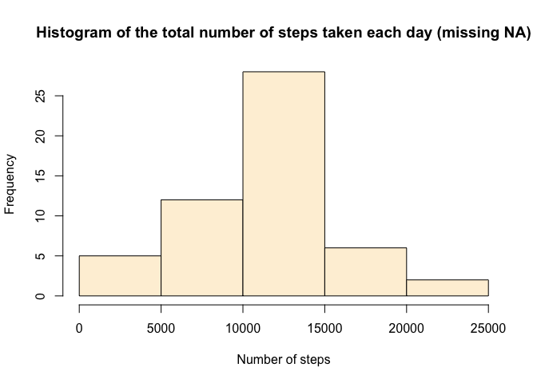
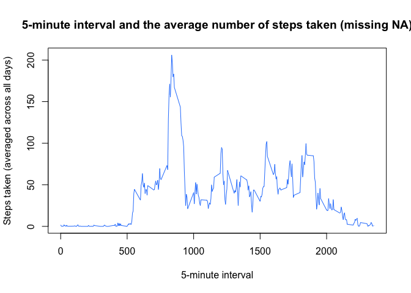
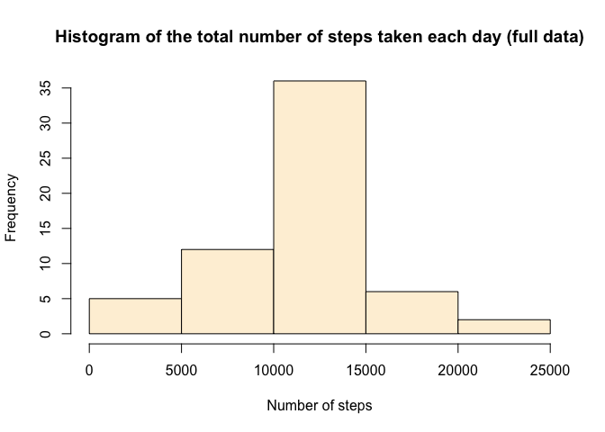
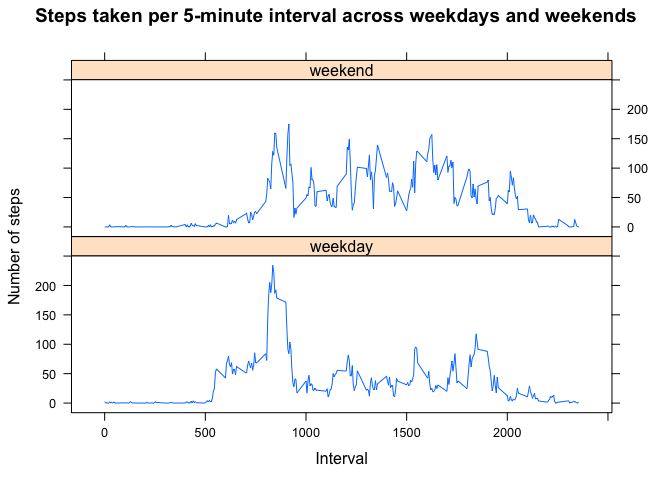

# Reproducible Research: Peer Assessment 1

## Loading and preprocessing the data

```r
## loading the data
table <- read.csv("activity.csv")
## clear NA values
table_nonNA <- subset(table, !is.na(table$steps))
```
---

## What is mean total number of steps taken per day?
### 1. Make a histogram of the total number of steps taken each day

```r
steps_total <- tapply(table_nonNA$steps, table_nonNA$date, sum)
par(mfrow = c(1, 1))
hist(steps_total, 
     main = "Histogram of the total number of steps taken each day (missing NA)", 
     col = "#fef0d9",
     xlab = "Number of steps")
```

 

### 2. Calculate and report the mean and median total number of steps taken per day

```r
library(dplyr)
table_mean_median <- table %>% 
      group_by(date) %>% 
      summarize(mean_steps = mean(steps, na.rm = TRUE), median_steps = median(steps, na.rm = TRUE)) 
```


```r
library(xtable)
## print table including days with NA-data
print.xtable(xtable(table_mean_median, 
                    caption = "The table includes days with NA-data (marked '--')", align = "cccc"),
             NA.string = "--",
             caption.placement = "top",
             html.table.attributes="width= 400",
             type = "html")
```

<!-- html table generated in R 3.1.3 by xtable 1.7-4 package -->
<!-- Wed May 13 12:05:16 2015 -->
<table width= 400>
<caption align="top"> The table includes days with NA-data (marked '--') </caption>
<tr> <th>  </th> <th> date </th> <th> mean_steps </th> <th> median_steps </th>  </tr>
  <tr> <td align="center"> 1 </td> <td align="center"> 2012-10-01 </td> <td align="center"> -- </td> <td align="center"> -- </td> </tr>
  <tr> <td align="center"> 2 </td> <td align="center"> 2012-10-02 </td> <td align="center"> 0.44 </td> <td align="center"> 0.00 </td> </tr>
  <tr> <td align="center"> 3 </td> <td align="center"> 2012-10-03 </td> <td align="center"> 39.42 </td> <td align="center"> 0.00 </td> </tr>
  <tr> <td align="center"> 4 </td> <td align="center"> 2012-10-04 </td> <td align="center"> 42.07 </td> <td align="center"> 0.00 </td> </tr>
  <tr> <td align="center"> 5 </td> <td align="center"> 2012-10-05 </td> <td align="center"> 46.16 </td> <td align="center"> 0.00 </td> </tr>
  <tr> <td align="center"> 6 </td> <td align="center"> 2012-10-06 </td> <td align="center"> 53.54 </td> <td align="center"> 0.00 </td> </tr>
  <tr> <td align="center"> 7 </td> <td align="center"> 2012-10-07 </td> <td align="center"> 38.25 </td> <td align="center"> 0.00 </td> </tr>
  <tr> <td align="center"> 8 </td> <td align="center"> 2012-10-08 </td> <td align="center"> -- </td> <td align="center"> -- </td> </tr>
  <tr> <td align="center"> 9 </td> <td align="center"> 2012-10-09 </td> <td align="center"> 44.48 </td> <td align="center"> 0.00 </td> </tr>
  <tr> <td align="center"> 10 </td> <td align="center"> 2012-10-10 </td> <td align="center"> 34.38 </td> <td align="center"> 0.00 </td> </tr>
  <tr> <td align="center"> 11 </td> <td align="center"> 2012-10-11 </td> <td align="center"> 35.78 </td> <td align="center"> 0.00 </td> </tr>
  <tr> <td align="center"> 12 </td> <td align="center"> 2012-10-12 </td> <td align="center"> 60.35 </td> <td align="center"> 0.00 </td> </tr>
  <tr> <td align="center"> 13 </td> <td align="center"> 2012-10-13 </td> <td align="center"> 43.15 </td> <td align="center"> 0.00 </td> </tr>
  <tr> <td align="center"> 14 </td> <td align="center"> 2012-10-14 </td> <td align="center"> 52.42 </td> <td align="center"> 0.00 </td> </tr>
  <tr> <td align="center"> 15 </td> <td align="center"> 2012-10-15 </td> <td align="center"> 35.20 </td> <td align="center"> 0.00 </td> </tr>
  <tr> <td align="center"> 16 </td> <td align="center"> 2012-10-16 </td> <td align="center"> 52.38 </td> <td align="center"> 0.00 </td> </tr>
  <tr> <td align="center"> 17 </td> <td align="center"> 2012-10-17 </td> <td align="center"> 46.71 </td> <td align="center"> 0.00 </td> </tr>
  <tr> <td align="center"> 18 </td> <td align="center"> 2012-10-18 </td> <td align="center"> 34.92 </td> <td align="center"> 0.00 </td> </tr>
  <tr> <td align="center"> 19 </td> <td align="center"> 2012-10-19 </td> <td align="center"> 41.07 </td> <td align="center"> 0.00 </td> </tr>
  <tr> <td align="center"> 20 </td> <td align="center"> 2012-10-20 </td> <td align="center"> 36.09 </td> <td align="center"> 0.00 </td> </tr>
  <tr> <td align="center"> 21 </td> <td align="center"> 2012-10-21 </td> <td align="center"> 30.63 </td> <td align="center"> 0.00 </td> </tr>
  <tr> <td align="center"> 22 </td> <td align="center"> 2012-10-22 </td> <td align="center"> 46.74 </td> <td align="center"> 0.00 </td> </tr>
  <tr> <td align="center"> 23 </td> <td align="center"> 2012-10-23 </td> <td align="center"> 30.97 </td> <td align="center"> 0.00 </td> </tr>
  <tr> <td align="center"> 24 </td> <td align="center"> 2012-10-24 </td> <td align="center"> 29.01 </td> <td align="center"> 0.00 </td> </tr>
  <tr> <td align="center"> 25 </td> <td align="center"> 2012-10-25 </td> <td align="center"> 8.65 </td> <td align="center"> 0.00 </td> </tr>
  <tr> <td align="center"> 26 </td> <td align="center"> 2012-10-26 </td> <td align="center"> 23.53 </td> <td align="center"> 0.00 </td> </tr>
  <tr> <td align="center"> 27 </td> <td align="center"> 2012-10-27 </td> <td align="center"> 35.14 </td> <td align="center"> 0.00 </td> </tr>
  <tr> <td align="center"> 28 </td> <td align="center"> 2012-10-28 </td> <td align="center"> 39.78 </td> <td align="center"> 0.00 </td> </tr>
  <tr> <td align="center"> 29 </td> <td align="center"> 2012-10-29 </td> <td align="center"> 17.42 </td> <td align="center"> 0.00 </td> </tr>
  <tr> <td align="center"> 30 </td> <td align="center"> 2012-10-30 </td> <td align="center"> 34.09 </td> <td align="center"> 0.00 </td> </tr>
  <tr> <td align="center"> 31 </td> <td align="center"> 2012-10-31 </td> <td align="center"> 53.52 </td> <td align="center"> 0.00 </td> </tr>
  <tr> <td align="center"> 32 </td> <td align="center"> 2012-11-01 </td> <td align="center"> -- </td> <td align="center"> -- </td> </tr>
  <tr> <td align="center"> 33 </td> <td align="center"> 2012-11-02 </td> <td align="center"> 36.81 </td> <td align="center"> 0.00 </td> </tr>
  <tr> <td align="center"> 34 </td> <td align="center"> 2012-11-03 </td> <td align="center"> 36.70 </td> <td align="center"> 0.00 </td> </tr>
  <tr> <td align="center"> 35 </td> <td align="center"> 2012-11-04 </td> <td align="center"> -- </td> <td align="center"> -- </td> </tr>
  <tr> <td align="center"> 36 </td> <td align="center"> 2012-11-05 </td> <td align="center"> 36.25 </td> <td align="center"> 0.00 </td> </tr>
  <tr> <td align="center"> 37 </td> <td align="center"> 2012-11-06 </td> <td align="center"> 28.94 </td> <td align="center"> 0.00 </td> </tr>
  <tr> <td align="center"> 38 </td> <td align="center"> 2012-11-07 </td> <td align="center"> 44.73 </td> <td align="center"> 0.00 </td> </tr>
  <tr> <td align="center"> 39 </td> <td align="center"> 2012-11-08 </td> <td align="center"> 11.18 </td> <td align="center"> 0.00 </td> </tr>
  <tr> <td align="center"> 40 </td> <td align="center"> 2012-11-09 </td> <td align="center"> -- </td> <td align="center"> -- </td> </tr>
  <tr> <td align="center"> 41 </td> <td align="center"> 2012-11-10 </td> <td align="center"> -- </td> <td align="center"> -- </td> </tr>
  <tr> <td align="center"> 42 </td> <td align="center"> 2012-11-11 </td> <td align="center"> 43.78 </td> <td align="center"> 0.00 </td> </tr>
  <tr> <td align="center"> 43 </td> <td align="center"> 2012-11-12 </td> <td align="center"> 37.38 </td> <td align="center"> 0.00 </td> </tr>
  <tr> <td align="center"> 44 </td> <td align="center"> 2012-11-13 </td> <td align="center"> 25.47 </td> <td align="center"> 0.00 </td> </tr>
  <tr> <td align="center"> 45 </td> <td align="center"> 2012-11-14 </td> <td align="center"> -- </td> <td align="center"> -- </td> </tr>
  <tr> <td align="center"> 46 </td> <td align="center"> 2012-11-15 </td> <td align="center"> 0.14 </td> <td align="center"> 0.00 </td> </tr>
  <tr> <td align="center"> 47 </td> <td align="center"> 2012-11-16 </td> <td align="center"> 18.89 </td> <td align="center"> 0.00 </td> </tr>
  <tr> <td align="center"> 48 </td> <td align="center"> 2012-11-17 </td> <td align="center"> 49.79 </td> <td align="center"> 0.00 </td> </tr>
  <tr> <td align="center"> 49 </td> <td align="center"> 2012-11-18 </td> <td align="center"> 52.47 </td> <td align="center"> 0.00 </td> </tr>
  <tr> <td align="center"> 50 </td> <td align="center"> 2012-11-19 </td> <td align="center"> 30.70 </td> <td align="center"> 0.00 </td> </tr>
  <tr> <td align="center"> 51 </td> <td align="center"> 2012-11-20 </td> <td align="center"> 15.53 </td> <td align="center"> 0.00 </td> </tr>
  <tr> <td align="center"> 52 </td> <td align="center"> 2012-11-21 </td> <td align="center"> 44.40 </td> <td align="center"> 0.00 </td> </tr>
  <tr> <td align="center"> 53 </td> <td align="center"> 2012-11-22 </td> <td align="center"> 70.93 </td> <td align="center"> 0.00 </td> </tr>
  <tr> <td align="center"> 54 </td> <td align="center"> 2012-11-23 </td> <td align="center"> 73.59 </td> <td align="center"> 0.00 </td> </tr>
  <tr> <td align="center"> 55 </td> <td align="center"> 2012-11-24 </td> <td align="center"> 50.27 </td> <td align="center"> 0.00 </td> </tr>
  <tr> <td align="center"> 56 </td> <td align="center"> 2012-11-25 </td> <td align="center"> 41.09 </td> <td align="center"> 0.00 </td> </tr>
  <tr> <td align="center"> 57 </td> <td align="center"> 2012-11-26 </td> <td align="center"> 38.76 </td> <td align="center"> 0.00 </td> </tr>
  <tr> <td align="center"> 58 </td> <td align="center"> 2012-11-27 </td> <td align="center"> 47.38 </td> <td align="center"> 0.00 </td> </tr>
  <tr> <td align="center"> 59 </td> <td align="center"> 2012-11-28 </td> <td align="center"> 35.36 </td> <td align="center"> 0.00 </td> </tr>
  <tr> <td align="center"> 60 </td> <td align="center"> 2012-11-29 </td> <td align="center"> 24.47 </td> <td align="center"> 0.00 </td> </tr>
  <tr> <td align="center"> 61 </td> <td align="center"> 2012-11-30 </td> <td align="center"> -- </td> <td align="center"> -- </td> </tr>
   </table>
---

## What is the average daily activity pattern?
### 1. Make a time series plot (i.e. type = "l") of the 5-minute interval (x-axis) and the average number of steps taken, averaged across all days (y-axis) 

```r
## split table by "interval"
table_interval <- table_nonNA %>% 
      group_by(interval) %>% 
      summarize(mean_steps = mean(steps, na.rm = TRUE)) 
## plot
plot(table_interval$interval, table_interval$mean_steps,
     type = "l", 
     col = "#2d83fd",
     main = "5-minute interval and the average number of steps taken (missing NA)",
     ylab = "Steps taken (averaged across all days)", 
     xlab = "5-minute interval")
```

 

### 2. Which 5-minute interval, on average across all the days in the dataset, contains the maximum number of steps?

```r
index <- which(table_interval$mean_steps == max(table_interval$mean_steps))
interval_val <- table_interval$interval[index]
```

Value of the 5-minute interval, on average, contains the maximum number of steps equals to **835**. This is the **104-th** interval in the table.

---

## Imputing missing values
###  1. Calculate and report the total number of missing values in the dataset (i.e. the total number of rows with NAs)

```r
num_of_NA_row <- length(table$steps[is.na(table$steps)])
```
The total number of missing values in the dataset is **2304** rows.

### 2. Devise a strategy for filling in all of the missing values in the dataset. The strategy does not need to be sophisticated. For example, you could use the mean/median for that day, or the mean for that 5-minute interval, etc.

The strategy of using the mean for 5-minute intervals is used for filling in all of missing values. Since the missing values strictly correspond to all the values of a particular day, we will use the same **data_vector** for all the days with missing values. Below is the code for creating the **data_vector** and filling in the missing values.

### 3. Create a new dataset that is equal to the original dataset but with the missing data filled in.

```r
## create new table for full data
table_full <- table

## find the amount of days with missing data
rep_index <- num_of_NA_row/nrow(table_interval)

## creating the data_vector
data_vector <- rep(table_interval$mean_steps, rep_index)

## change all the missing data in the table with the mean for 5-minute interval for every day (total 8 days)
table_full$steps[is.na(table$steps)] <- data_vector
```

### 4. Make a histogram of the total number of steps taken each day and calculate and report the mean and median total number of steps taken per day. Do these values differ from the estimates from the first part of the assignment? What is the impact of imputing missing data on the estimates of the total daily number of steps?

```r
steps_total <- tapply(table_full$steps, table_full$date, sum)
## histogram of the total number of steps taken each day after missing values
hist(steps_total, 
     main = "Histogram of the total number of steps taken each day (full data)",  
     col = "#fef0d9",
     xlab = "Number of steps")
```

 


```r
## Calculate and report the mean and median total number ...
library(dplyr)
table_mean_median_full <- table_full %>% 
      group_by(date) %>% 
      summarize(mean_steps = mean(steps, na.rm = TRUE),
                median_steps = median(steps, na.rm = TRUE)) 

## print table with the missing data filled in.
print.xtable(xtable(table_mean_median_full, 
                    caption = "The table with the missing data filled in", align = "cccc"),
             caption.placement = "top",
             html.table.attributes="width= 400", 
             type = "html")
```

<!-- html table generated in R 3.1.3 by xtable 1.7-4 package -->
<!-- Wed May 13 12:05:16 2015 -->
<table width= 400>
<caption align="top"> The table with the missing data filled in </caption>
<tr> <th>  </th> <th> date </th> <th> mean_steps </th> <th> median_steps </th>  </tr>
  <tr> <td align="center"> 1 </td> <td align="center"> 2012-10-01 </td> <td align="center"> 37.38 </td> <td align="center"> 34.11 </td> </tr>
  <tr> <td align="center"> 2 </td> <td align="center"> 2012-10-02 </td> <td align="center"> 0.44 </td> <td align="center"> 0.00 </td> </tr>
  <tr> <td align="center"> 3 </td> <td align="center"> 2012-10-03 </td> <td align="center"> 39.42 </td> <td align="center"> 0.00 </td> </tr>
  <tr> <td align="center"> 4 </td> <td align="center"> 2012-10-04 </td> <td align="center"> 42.07 </td> <td align="center"> 0.00 </td> </tr>
  <tr> <td align="center"> 5 </td> <td align="center"> 2012-10-05 </td> <td align="center"> 46.16 </td> <td align="center"> 0.00 </td> </tr>
  <tr> <td align="center"> 6 </td> <td align="center"> 2012-10-06 </td> <td align="center"> 53.54 </td> <td align="center"> 0.00 </td> </tr>
  <tr> <td align="center"> 7 </td> <td align="center"> 2012-10-07 </td> <td align="center"> 38.25 </td> <td align="center"> 0.00 </td> </tr>
  <tr> <td align="center"> 8 </td> <td align="center"> 2012-10-08 </td> <td align="center"> 37.38 </td> <td align="center"> 34.11 </td> </tr>
  <tr> <td align="center"> 9 </td> <td align="center"> 2012-10-09 </td> <td align="center"> 44.48 </td> <td align="center"> 0.00 </td> </tr>
  <tr> <td align="center"> 10 </td> <td align="center"> 2012-10-10 </td> <td align="center"> 34.38 </td> <td align="center"> 0.00 </td> </tr>
  <tr> <td align="center"> 11 </td> <td align="center"> 2012-10-11 </td> <td align="center"> 35.78 </td> <td align="center"> 0.00 </td> </tr>
  <tr> <td align="center"> 12 </td> <td align="center"> 2012-10-12 </td> <td align="center"> 60.35 </td> <td align="center"> 0.00 </td> </tr>
  <tr> <td align="center"> 13 </td> <td align="center"> 2012-10-13 </td> <td align="center"> 43.15 </td> <td align="center"> 0.00 </td> </tr>
  <tr> <td align="center"> 14 </td> <td align="center"> 2012-10-14 </td> <td align="center"> 52.42 </td> <td align="center"> 0.00 </td> </tr>
  <tr> <td align="center"> 15 </td> <td align="center"> 2012-10-15 </td> <td align="center"> 35.20 </td> <td align="center"> 0.00 </td> </tr>
  <tr> <td align="center"> 16 </td> <td align="center"> 2012-10-16 </td> <td align="center"> 52.38 </td> <td align="center"> 0.00 </td> </tr>
  <tr> <td align="center"> 17 </td> <td align="center"> 2012-10-17 </td> <td align="center"> 46.71 </td> <td align="center"> 0.00 </td> </tr>
  <tr> <td align="center"> 18 </td> <td align="center"> 2012-10-18 </td> <td align="center"> 34.92 </td> <td align="center"> 0.00 </td> </tr>
  <tr> <td align="center"> 19 </td> <td align="center"> 2012-10-19 </td> <td align="center"> 41.07 </td> <td align="center"> 0.00 </td> </tr>
  <tr> <td align="center"> 20 </td> <td align="center"> 2012-10-20 </td> <td align="center"> 36.09 </td> <td align="center"> 0.00 </td> </tr>
  <tr> <td align="center"> 21 </td> <td align="center"> 2012-10-21 </td> <td align="center"> 30.63 </td> <td align="center"> 0.00 </td> </tr>
  <tr> <td align="center"> 22 </td> <td align="center"> 2012-10-22 </td> <td align="center"> 46.74 </td> <td align="center"> 0.00 </td> </tr>
  <tr> <td align="center"> 23 </td> <td align="center"> 2012-10-23 </td> <td align="center"> 30.97 </td> <td align="center"> 0.00 </td> </tr>
  <tr> <td align="center"> 24 </td> <td align="center"> 2012-10-24 </td> <td align="center"> 29.01 </td> <td align="center"> 0.00 </td> </tr>
  <tr> <td align="center"> 25 </td> <td align="center"> 2012-10-25 </td> <td align="center"> 8.65 </td> <td align="center"> 0.00 </td> </tr>
  <tr> <td align="center"> 26 </td> <td align="center"> 2012-10-26 </td> <td align="center"> 23.53 </td> <td align="center"> 0.00 </td> </tr>
  <tr> <td align="center"> 27 </td> <td align="center"> 2012-10-27 </td> <td align="center"> 35.14 </td> <td align="center"> 0.00 </td> </tr>
  <tr> <td align="center"> 28 </td> <td align="center"> 2012-10-28 </td> <td align="center"> 39.78 </td> <td align="center"> 0.00 </td> </tr>
  <tr> <td align="center"> 29 </td> <td align="center"> 2012-10-29 </td> <td align="center"> 17.42 </td> <td align="center"> 0.00 </td> </tr>
  <tr> <td align="center"> 30 </td> <td align="center"> 2012-10-30 </td> <td align="center"> 34.09 </td> <td align="center"> 0.00 </td> </tr>
  <tr> <td align="center"> 31 </td> <td align="center"> 2012-10-31 </td> <td align="center"> 53.52 </td> <td align="center"> 0.00 </td> </tr>
  <tr> <td align="center"> 32 </td> <td align="center"> 2012-11-01 </td> <td align="center"> 37.38 </td> <td align="center"> 34.11 </td> </tr>
  <tr> <td align="center"> 33 </td> <td align="center"> 2012-11-02 </td> <td align="center"> 36.81 </td> <td align="center"> 0.00 </td> </tr>
  <tr> <td align="center"> 34 </td> <td align="center"> 2012-11-03 </td> <td align="center"> 36.70 </td> <td align="center"> 0.00 </td> </tr>
  <tr> <td align="center"> 35 </td> <td align="center"> 2012-11-04 </td> <td align="center"> 37.38 </td> <td align="center"> 34.11 </td> </tr>
  <tr> <td align="center"> 36 </td> <td align="center"> 2012-11-05 </td> <td align="center"> 36.25 </td> <td align="center"> 0.00 </td> </tr>
  <tr> <td align="center"> 37 </td> <td align="center"> 2012-11-06 </td> <td align="center"> 28.94 </td> <td align="center"> 0.00 </td> </tr>
  <tr> <td align="center"> 38 </td> <td align="center"> 2012-11-07 </td> <td align="center"> 44.73 </td> <td align="center"> 0.00 </td> </tr>
  <tr> <td align="center"> 39 </td> <td align="center"> 2012-11-08 </td> <td align="center"> 11.18 </td> <td align="center"> 0.00 </td> </tr>
  <tr> <td align="center"> 40 </td> <td align="center"> 2012-11-09 </td> <td align="center"> 37.38 </td> <td align="center"> 34.11 </td> </tr>
  <tr> <td align="center"> 41 </td> <td align="center"> 2012-11-10 </td> <td align="center"> 37.38 </td> <td align="center"> 34.11 </td> </tr>
  <tr> <td align="center"> 42 </td> <td align="center"> 2012-11-11 </td> <td align="center"> 43.78 </td> <td align="center"> 0.00 </td> </tr>
  <tr> <td align="center"> 43 </td> <td align="center"> 2012-11-12 </td> <td align="center"> 37.38 </td> <td align="center"> 0.00 </td> </tr>
  <tr> <td align="center"> 44 </td> <td align="center"> 2012-11-13 </td> <td align="center"> 25.47 </td> <td align="center"> 0.00 </td> </tr>
  <tr> <td align="center"> 45 </td> <td align="center"> 2012-11-14 </td> <td align="center"> 37.38 </td> <td align="center"> 34.11 </td> </tr>
  <tr> <td align="center"> 46 </td> <td align="center"> 2012-11-15 </td> <td align="center"> 0.14 </td> <td align="center"> 0.00 </td> </tr>
  <tr> <td align="center"> 47 </td> <td align="center"> 2012-11-16 </td> <td align="center"> 18.89 </td> <td align="center"> 0.00 </td> </tr>
  <tr> <td align="center"> 48 </td> <td align="center"> 2012-11-17 </td> <td align="center"> 49.79 </td> <td align="center"> 0.00 </td> </tr>
  <tr> <td align="center"> 49 </td> <td align="center"> 2012-11-18 </td> <td align="center"> 52.47 </td> <td align="center"> 0.00 </td> </tr>
  <tr> <td align="center"> 50 </td> <td align="center"> 2012-11-19 </td> <td align="center"> 30.70 </td> <td align="center"> 0.00 </td> </tr>
  <tr> <td align="center"> 51 </td> <td align="center"> 2012-11-20 </td> <td align="center"> 15.53 </td> <td align="center"> 0.00 </td> </tr>
  <tr> <td align="center"> 52 </td> <td align="center"> 2012-11-21 </td> <td align="center"> 44.40 </td> <td align="center"> 0.00 </td> </tr>
  <tr> <td align="center"> 53 </td> <td align="center"> 2012-11-22 </td> <td align="center"> 70.93 </td> <td align="center"> 0.00 </td> </tr>
  <tr> <td align="center"> 54 </td> <td align="center"> 2012-11-23 </td> <td align="center"> 73.59 </td> <td align="center"> 0.00 </td> </tr>
  <tr> <td align="center"> 55 </td> <td align="center"> 2012-11-24 </td> <td align="center"> 50.27 </td> <td align="center"> 0.00 </td> </tr>
  <tr> <td align="center"> 56 </td> <td align="center"> 2012-11-25 </td> <td align="center"> 41.09 </td> <td align="center"> 0.00 </td> </tr>
  <tr> <td align="center"> 57 </td> <td align="center"> 2012-11-26 </td> <td align="center"> 38.76 </td> <td align="center"> 0.00 </td> </tr>
  <tr> <td align="center"> 58 </td> <td align="center"> 2012-11-27 </td> <td align="center"> 47.38 </td> <td align="center"> 0.00 </td> </tr>
  <tr> <td align="center"> 59 </td> <td align="center"> 2012-11-28 </td> <td align="center"> 35.36 </td> <td align="center"> 0.00 </td> </tr>
  <tr> <td align="center"> 60 </td> <td align="center"> 2012-11-29 </td> <td align="center"> 24.47 </td> <td align="center"> 0.00 </td> </tr>
  <tr> <td align="center"> 61 </td> <td align="center"> 2012-11-30 </td> <td align="center"> 37.38 </td> <td align="center"> 34.11 </td> </tr>
   </table>

---

## Are there differences in activity patterns between weekdays and weekends?
### 1. Create a new factor variable in the dataset with two levels -- "weekday" and "weekend" indicating whether a given date is a weekday or weekend day.

```r
table_nonNA$date <- as.Date(table_nonNA$date)
table_nonNA$weeks <-  sapply(table_nonNA$date, weekdays)

## identifying the days of the week (both "weekend" and "weekday")
table_nonNA$weekdays <- sapply(1:nrow(table_nonNA), 
                               function(x) {
                                     if ((table_nonNA$weeks[x] == "Sunday")
                                         |(table_nonNA$weeks[x] == "Saturday")) "weekend" 
                                     else "weekday" })

table_nonNA$weekdays <- as.factor(table_nonNA$weekdays)

## split table by "weekend" and "weekday"
table_weeks <- table_nonNA %>% 
      group_by(interval, weekdays) %>% 
      summarize(mean_steps = mean(steps, na.rm = TRUE)) 
```

### 2. Make a panel plot containing a time series plot (i.e. type = "l") of the 5-minute interval (x-axis) and the average number of steps taken, averaged across all weekday days or weekend days (y-axis). The plot should look something like the following, which was created using simulated data:

```r
library(lattice)
xyplot(mean_steps ~ interval | weekdays, 
       data = table_weeks, 
       layout = c(1, 2), 
       type="l", 
       xlab = "Interval", 
       ylab = "Number of steps", 
       main = "Steps taken per 5-minute interval across weekdays and weekends")
```

 

